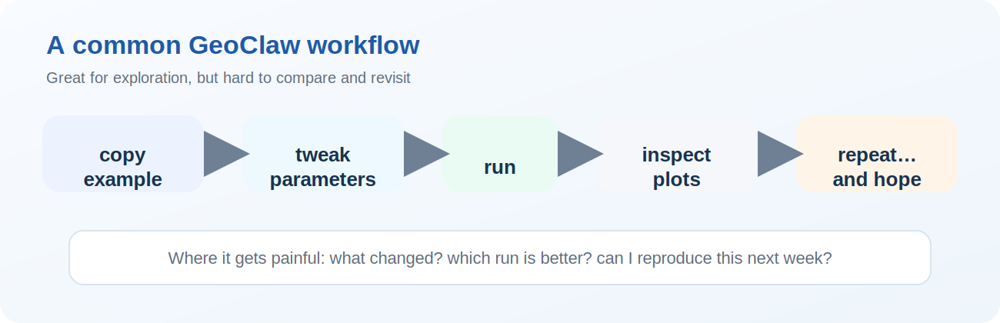
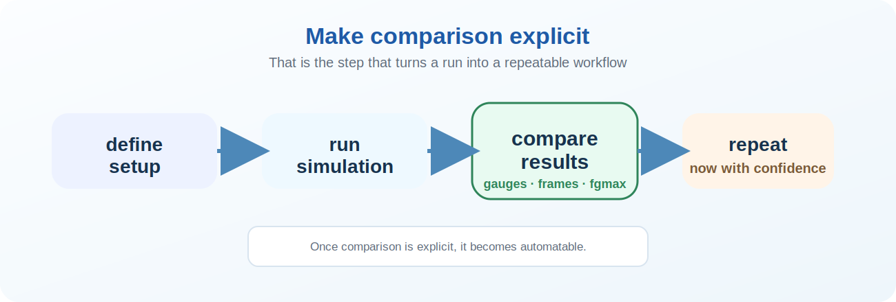
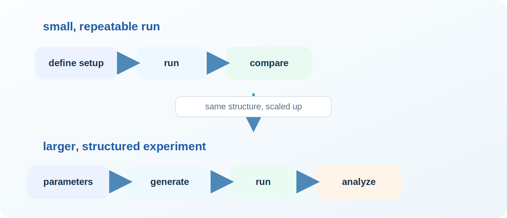

## How we actually use GeoClaw

{width=98%}

::: notes
I think this is how a lot of us actually use GeoClaw.

We start from an example, tweak a few parameters, run it, look at the plots, and then repeat.  And at some point you have a directory full of runs like run_final_v3_really_final…

Maybe we change the resolution, or the topography, or the forcing.
That works really well for exploration.

But the moment we want to compare runs carefully, or come back later, things can get messy.
:::

## Where this gets painful

- Hard to reproduce results later
- Hard to compare runs systematically
- Easy to break something silently

::: notes
If you have ever come back to a run a week later and thought “what exactly did I change?” then this is the problem.

The issue is not really running GeoClaw.
The issue is managing and comparing runs in a reliable way.
:::

## What we actually want

- Re-run the same setup reliably
- Compare runs automatically
- Scale from 1 → many experiments

::: notes
So what do we actually want instead?

We want to be able to rerun the same setup and trust that it is the same.
We want comparison to be explicit.
And we want to scale from a single run to multiple experiments without everything becoming unmanageable.
:::

## A better workflow

{width=100%}

::: notes
A useful way to think about this is as a simple loop.

**Define** a setup, **run** the simulation, **compare** the results, and **repeat**.

The key shift is: make that compare step explicit.
Once that step is explicit, you can automate it.
And once you can automate it, you can scale it.
:::

## A simple idea

> Treat simulation runs as repeatable checks

- Define a setup
- Run it
- Compare to a reference
- Let `pytest` organize the loop

::: notes
The key shift is very simple.

Instead of treating runs as one-off experiments, we treat them as repeatable checks.

At that point, testing tools are useful not because we want to turn everyone into developers, but because they already solve the organizational problem.  

You don’t need to adopt `pytest` as a framework—this is just using it as a lightweight tool.
:::

## A GeoClaw test in practice

::: {.small-code}
```python
runner = test.GeoClawTestRunner(tmp_path, test_path=Path(__file__).parent)
runner.set_data()
runner.write_data()

runner.build_executable()
runner.run_code()
```
:::

- same GeoClaw workflow
- now repeatable and reusable

::: notes
At a high level, this is the same workflow many of us already use.

We set up the data, write the input files, build the executable, and run it.

The difference is that this is now packaged into something repeatable, so we can rerun it later or in CI without changing the basic GeoClaw workflow.

[Sources]
- Adapted from uploaded GeoClaw tests: bowl_slosh and ike
:::

## Example: bowl-slosh

::: {.small-code}
```python
runner.rundata.gaugedata.gauges.append([1, 0.5, 0.5, 0, 1e10])
...
runner.check_gauge(save=save, gauge_id=1, indices=(2, 3))
runner.check_fgmax(save=save)
```
:::
- generated topography
- one gauge
- one fgmax grid
- compares outputs you actually care about


::: notes
The bowl-slosh test is a nice compact example.

It generates the topography programmatically, runs a short GeoClaw simulation, and then compares both a gauge time series and fgmax output.

This is already more than “did the code run?”
It is checking outputs that users actually care about.

So that’s one clean, controlled example. Now let’s take the same idea and scale
it up.

[Sources]
- Adapted from uploaded file: test_bowl_slosh.py
:::

## Parameterization: Hurricane Ike

::: {.small-code}
```python
CASES = [
    pytest.param({"num_cells": [29, 24], "amr_levels_max": 2,
                  "num_output_times": 1}, id="coarse"),
    pytest.param({"num_cells": [116, 96], "amr_levels_max": 6,
                  "num_output_times": 16}, id="fine",
                  marks=pytest.mark.slow),
]
```
:::
- same physical problem
- different grids / AMR settings
- fast default + slower, higher-fidelity run

::: notes
Once the basic structure is in place, parameterization becomes natural.

Here the same Ike setup is used with different grid and AMR settings.
That lets us represent a quick default case and a finer, slower case inside one framework.

The coarse case is a regression test.
The fine case can be used as a slower, higher-fidelity check.

[Sources]
- Adapted from uploaded file: test_ike.py
:::

## This is for users too

> This is **not** about forcing everyone into developer-style tests.

- It helps you rerun cases cleanly
- It helps you compare outputs you already care about
- It gives you a path from one example to many related experiments

::: notes
I want to make this point very clearly.

This is **not** about turning you into a developer

It is about taking the workflows people already use and making them more reliable.
So you can rerun them, compare them, and build on them without starting over every time.
:::

## From tests to workflows

{width=100%}

- synthetic topography and forcing
- controlled scenarios in `surge-examples/synthetic`
- larger workflow automation in `surge-examples/auto_workflow`
- same structure, just scaled up

::: notes
Once you can generate topography, vary setup parameters, and compare outputs systematically, the line between a test and an experiment starts to blur.

That is the bridge to synthetic scenarios and automated workflows.

So one useful mental model is:
small tests are just small, repeatable runs;
and larger workflows are the same idea applied at a larger scale.

[Sources]
- Synthetic scenarios: https://github.com/mandli/surge-examples/tree/main/synthetic
- Automated workflows: https://github.com/mandli/surge-examples/tree/main/auto_workflow
- Docs/refactor context: https://github.com/clawpack/doc/pull/239
:::

## Takeaways

- Start from an example you already trust
- Make the run / compare loop repeatable
- Parameterize one thing first
- Grow into a workflow only when it helps

::: notes
If you want to try this, the easiest way is to start with something you already run.

Wrap it in a simple structure, parameterize one thing, and see how it feels.
You do not have to adopt everything at once.
:::

## Pointers {.smaller}

- Synthetic scenarios: <https://github.com/mandli/surge-examples/tree/main/synthetic>
- Auto workflow: <https://github.com/mandli/surge-examples/tree/main/auto_workflow>
- Testing refactor pull requests:
  - GeoClaw <https://github.com/clawpack/geoclaw/pull/697>
  - Docs <https://github.com/clawpack/doc/pull/239>
  - AMRClaw <https://github.com/clawpack/amrclaw/pull/310>
  - Classic <https://github.com/clawpack/classic/pull/96>
- Workshop: <https://www.clawpack.org/geoclaw-users-2026/>
